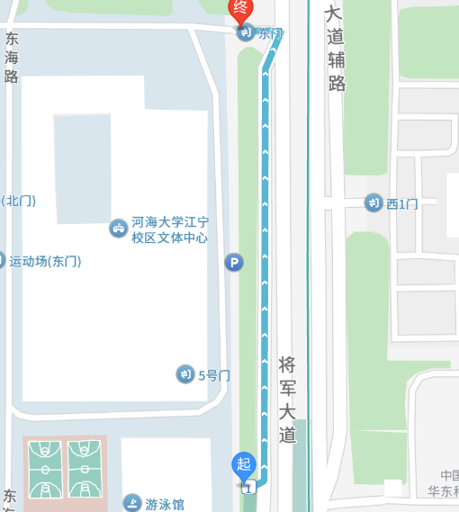
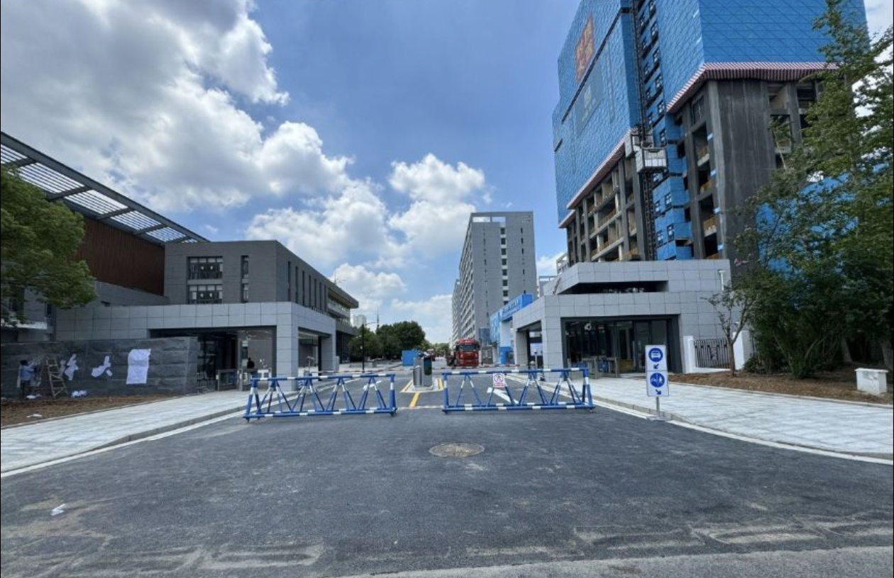
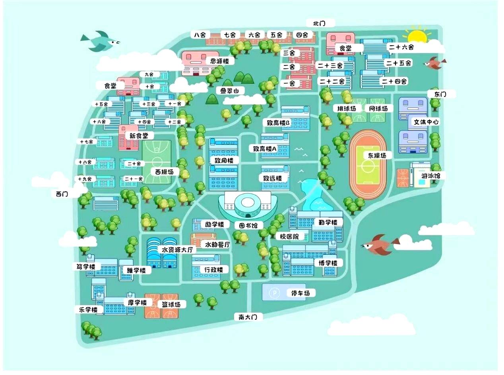

# 报到

### 路线指引

:::tip

本版面目前仅面向大一新生,因此仅考虑江宁校区的情况

:::

:::details 机场路线

南京仅有一个机场,即**南京禄口国际机场**
飞机到达后请乘坐**S1 号线**,往**南京南站方向**

```flow
st=>start: 禄口机场(东南入口)
e=>end: 河海大学•佛城西路(1号口)
op1=>operation: 翔宇路南
op2=>operation: 翔宇路北
op3=>operation: 正方中路
op4=>operation: 吉印大道

st->op1->op2->op3->op4->e
```

到达站点**河海大学•佛城西路**并且从**1 号口**出站,此时向北步行约 100m,左手边即为河海大学江宁校区东门




:::

:::details 火车/高铁

**推荐购买到达 ==南京南站== 的火车票!!!!**

### 南京南站

火车到达后后请乘坐**S1 号线**,往**空港新城江宁方向**

```flow
st=>start: 禄口机场(东南入口)
e=>end: 河海大学•佛城西路(1号口)
op1=>operation: 翠屏山

st->op1->e
```

### 南京站

火车到达后后可以乘坐**1 号线**或者**3 号线**,最终都是在**南京南站**转乘**S1 号线**

```flow
st=>start: 南京站
e=>end: 河海大学•佛城西路(1号口)

op1a=>operation: 新模范马路
op2a=>operation: 玄武门
op3a=>operation: 鼓楼
op4a=>operation: 珠江路
op5a=>operation: 新街口
op6a=>operation: 张府园
op7a=>operation: 三山街
op8a=>operation: 中华门
op9a=>operation: 安德门
op10a=>operation: 天隆寺
op11a=>operation: 软件大道
op12a=>operation: 花神庙
op13a=>operation: 南京南站

op1b=>operation: 南京林业大学•新庄
op2b=>operation: 鸡鸣寺
op3b=>operation: 浮桥
op4b=>operation: 大行宫
op5b=>operation: 常府街
op6b=>operation: 夫子庙
op7b=>operation: 武定门
op8b=>operation: 雨花门
op9b=>operation: 卡子门
op10b=>operation: 大明路
op11b=>operation: 明发广场
op12b=>operation: 南京南站

op14=>operation: 翠屏山
io=>inputoutput: 转乘S1号线
cond=>condition: 选择1号线?

st->cond
cond(yes)->op1a->op2a->op3a->op4a->op5a->op6a->op7a->op8a->op9a->op10a->op11a->op12a->op13a->io
cond(no)->op1b->op2b->op3b->op4b->op5b->op6b->op7b->op8b->op9b->op10b->op11b->op12b->io
io->op14->e
```

:::



### Q&A

:::info 可不可以提前来学校?

- 住宿舍:可以提前两天左右
- 参观:随时都可以,家长也可以进

:::

:::info 报道的时候车辆能不能进学校?

是可以的,并且建议走东门,如有必要,使用一点技巧

:::

:::info 报道的时候家长能不能进学校与宿舍?

是可以的,直接进就可以了

:::

:::info 报道要带什么?

- **事实上!录取通知书-新生须知已经告诉你了!**
- 证件
  - 录取通知书
  - 身份证
  - 户口本复印件
  - 高考准考证
  - 贫困生证明材料(仅贫困生需要)
- 照片
  - 蓝/红底电子证件照,8 张彩色免冠近照(**一寸**)
- 档案
  - 必须是密封上交
  - 团员关系介绍信等物品,可以放在档案袋里,也可以单独上交
- 银行卡 - 随录取通知书送达,用于缴纳与接收各种学校的钱款

:::

:::info 报道要干什么?

- 上交相关材料
- 领取宿舍钥匙

:::
