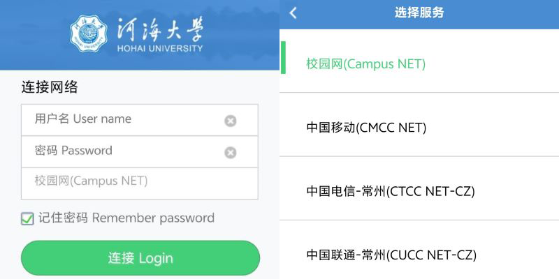
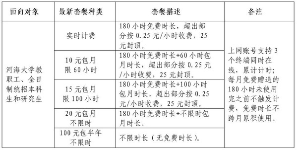
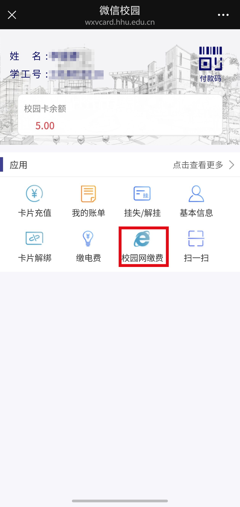
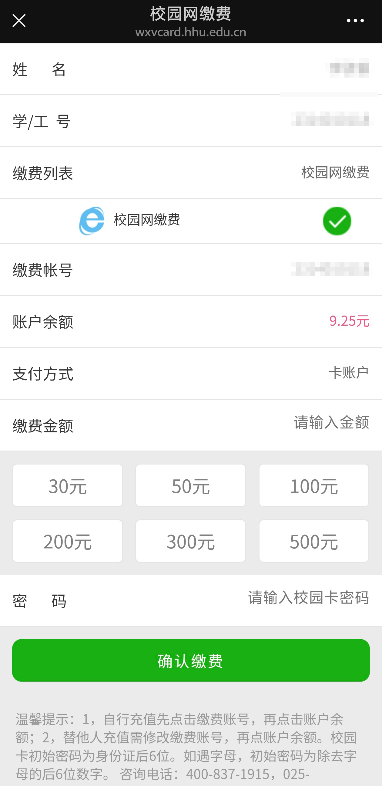

# 校园网与校园卡

:::tip

- **在接下来的文本里,我们约定以下内容** - "校园 WiFi" == "**Hohai University**"这个 WiFi 网络以及**你自己的路由器网络** - "校园网" == "**校园网(Campu Net)**" - "校园卡网络" == "**中国移动(CMCC NET)**"/"**中国电信-常州(CTCC NET-CZ)**"/"**中国联通-常州(CUCC NET-CZ)**"

:::

### 如何**连接与登录**校园 WiFi

1. 连接校园 WiFi
2. 等待弹出登陆验证界面(左)(电脑打开浏览器随便点击一个界面)
3. 如果没有自动弹出,尝试访问:http://eportal.hhu.edu.cn/ 或 10.96.0.155
4. 账号:你的学号 密码:你身份证的后六位或与信息门户密码一致
5. 选择服务,默认为校园网,点击可切换(右)
6. 成功登录

:::info 校园网与校园卡网络的区别

- 速度:没有实验证明校园卡网络快于校园网,本学年将会更新全校各点位的测速地图
- 稳定性:无差别
- 适用范围:
  - 校园网,中国移动(CMCC NET):全部校区
  - 中国电信-常州(CTCC NET-CZ),中国联通-常州(CUCC NET-CZ):金坛校区

:::

### 校园网与校园卡网络的区别

- 校园网收费

  - 所有人会被赠送 180h/月免费时长
  - 多设备登录，消耗时长会叠加。
  :::tip 实例
  - 诶我怎么今天少了 24 小时
    - 平板忘记断开连接了
    - 宿舍里电脑在挂学习通
    - 手机还在打游戏
      今日共计使用网络时长=8h\*3=24h(假设每个设备在线 8h)
  :::

  - 需要注意的是,新生入学的第一个月,似乎不能切换套餐
  - 在公众号“河海大学计财处”充值缴费

  

:::info 校园网缴费

:::details

:::

:::info 切换校园网套餐

浏览器输入网址"10.96.0.154:8080"按如下顺序:登录-套餐变更-选择套餐

:::

:::caution 如果你要办理校园卡

1. 月付大于 20 元,不要买!!!
2. 问明白流量是全国流量还是地区流量
3. 问明白优惠套餐的持续时间,有的套餐仅优惠两年,之后收取 40r/月

:::
