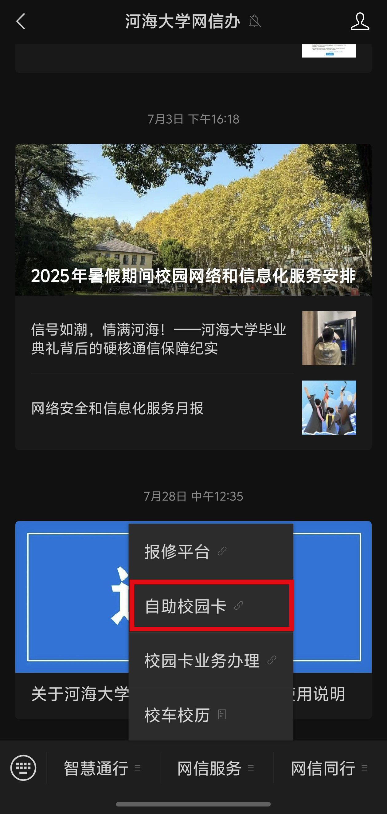
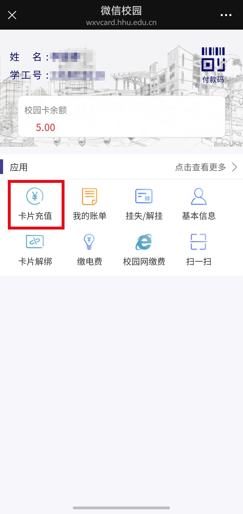
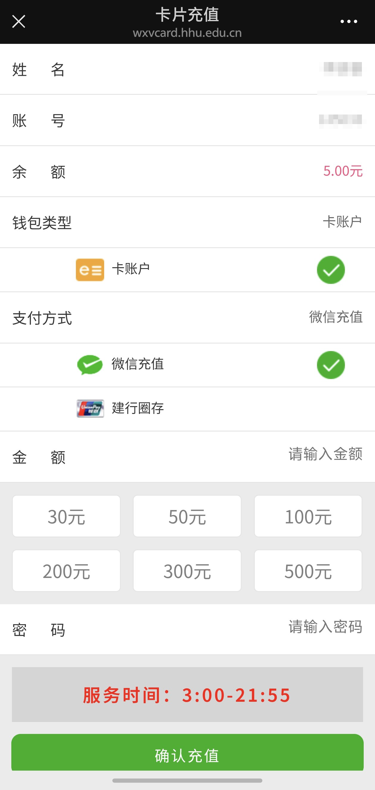

# 一卡通与学生证

### 一卡通功能

- 在食堂与超市消费.(~~因为都可以扫码支付所以这个功能十分鸡肋.~~)
- 打开门禁.
  - 江宁校区的大门没有门禁(悲)
  - 图书馆有门禁,而且你刷卡会记录你的入馆次数,借书也需要一卡通.(~~没带卡和阿姨说一下也可以进去~~)
  - 宿舍门禁.无需多言
- ~~在使用各种学生优惠的时候出示~~(感觉不如...学生证)

:::details 一卡通充值
**关注公众号 河海大学网信办**

:::

### 学生证功能

- ~~证明自己是个学生(误)~~
- 期中和期末考试要带着,不可以用一卡通代替
