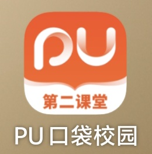

# 学时与 pu 口袋校园

### Q&A

:::info pu 口袋校园是什么

~~是个垃圾广告 app~~
是学时的申请,发放,认证软件,学校会给你账号的

:::

:::warning 学时阶段性对照表

| 学期     | 寒暑期社会实践 | 公益劳动类 | 课外活动类（文化艺术） | 总学时 |
| -------- | -------------- | ---------- | ---------------------- | ------ |
| 第一学期 | 0              | 3          | 10                     | \      |
| 第二学期 | 0              | 7          | 20                     | \      |
| 第三学期 | 25             | 10         | 30（10）               | \      |
| 第四学期 | 25             | 14         | 40（14）               | \      |
| 第五学期 | 55             | 17         | 50（17）               | \      |
| 第六学期 | 80             | 20         | 60（20）               | 200    |

:::

:::info 学时是什么?

学时与学分是不同的东西,学时是你的课外活动证明,学分是完成课程获得的,学时仅影响部分荣誉的定与毕业,**不影响保研考研**，但**阶段性不达标**可能会影响评奖评优

四年累计获得**200**个就可以正常毕业,学时分为以下类型

- 社会实践学时:**80**个
  - 寒暑假社会实践学时:**80**个
  - 团队实践:**30**个(意思是你参加的寒暑假社会实践至少要有一个是团队形式,一般通过参加"**源泉工程**"回高中宣讲来完成指标)
- 公益劳动学时(志愿学时):**20**个
- 课外活动学时:**60**个
  - 文化艺术:**20**个
- 为什么 80+20+60<200? - 因为这里给出的是最低要求,你需要超出最低需求一点才能拿满 200 个学时
  
:::

:::info 如何获得学时?

1. 寒暑假社会实践:顾名思义不解释
2. 公益劳动:在学校组织的活动里担任志愿者,以及校/院青协,红十字等组织的活动(一般只给成员)
3. 课外活动与文化艺术:参与社团的中大型活动,或者观看社团演出,以及参与一些比赛并获奖
4. 不用着急除志愿学时和文化艺术学时以外的学时，学时的总数很容易凑，各种竞赛或者证书加学很多~

:::

:::warning

学时不会缺少的,所以不要因为学时的诱惑,过度出卖自己的实践与精力

:::
