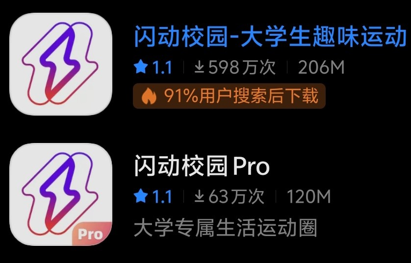

# 校园跑与闪动校园

### 覆盖人群

- 大一大二学生

### 校园跑次数与里程与时间

:::info 跑步时段

**06:00-09:00** 晨跑时段
**09:01-22:00** 普通跑时段

:::

| 政策要求(2024) | 详情                                                                                           |
| -------------- | ---------------------------------------------------------------------------------------------- |
| 每次里程       | 男生：每次 2 公里，女生：每次 1.5 公里                                                         |
| 总有效完成次数 | 不少于 45 次                                                                                   |
| 每日记录       | 每天只记录一次有效成绩，多跑的次数不予记录（活动奖励的次数除外）                               |
| 大一额外要求   | 大一年级须完成 15 次晨跑有效次数                                                               |
| AI 锻炼        | 如遇恶劣天气可使用闪动校园版 APP 中的 AI 作业功能进行室内锻炼，AI 锻炼最多只能代替 15 次阳光跑 |

### Q&A

:::info 跑步使用的软件是什么?

一定要下载 ==闪动校园 pro== !**(无广告)**
千万不要使用**闪动校园**(~~开屏广告的精度可以当地震监测~~)

账号学校会给你的

:::

:::info AI 作业 是什么?

手机拍摄识别,在一定时间内完成跳绳,深蹲,开合跳,高抬腿等动作.
每学期可以进行 15 次,一次 AI 作业可以抵一次校园跑.

:::

:::caution

依据 2024 的情况,强烈不推荐进行 AI 作业,识别精度低,运动强度也反人类(~~闪动运维你自己试过吗~~)

:::

:::info 不完成校园跑会怎么样?

规定上来说,你的体育期末总分需要\*0.7 计算,但是很多体育老师不管这个,你一次也不跑也给你 90 分.建议还是跑一下吧

:::

:::info 校园跑能不能减免?

1. 参加校运动队（足球队、篮球队、田径队等）作为正式成员可以免掉所有闪动
2. 参加一些额外活动

- 校园 mini 马一般减免 5 次
- 开学团体操训练 减免 20 次好像（？）还给文化艺术学时
- 荧光夜跑活动，按照里程减免次数
- 校外马拉松赛事，半程马拉松可以减一半~~全程马拉松就别想了~~

3. 当兵回来也全部免掉

:::
